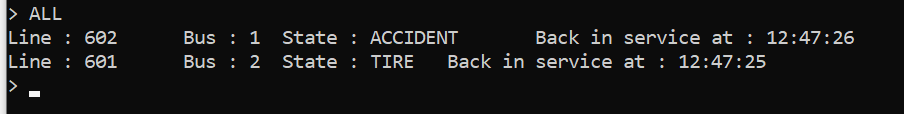
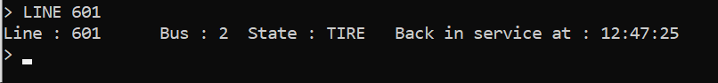
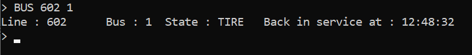
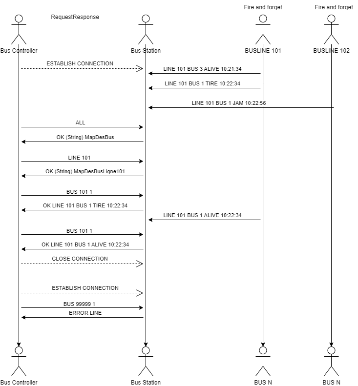

# practical-work-3 - DAI

#### By Alan Sottile & Calvin Graf | HEIG-VD | 19.12.2023

## Description

Our application implements Unicast and Multicast in a Docker container.

The "Bus" class allows buses to be created with their number and line as parameters. They send their current status on a regular basis.

The "BusStation" class is used to store the status of our buses and respond to requests from the bus controller.

The "BusController" class allows the user to retrieve information about all the buses, a particular line or a specific bus.

## How to use it ? 

Here are the different steps to use our application with examples, the order in which you execute the steps is not important, except that you need to start the station before the controller:

#### Step 1

Start the bus station by entering this command in a terminal opened on the folder containing the pom.xml file (practical-work-3): 

    java -jar target/practical-content-3-1.0-SNAPSHOT.jar bus-station -i eth3 -H 239.0.0.1

  - i takes the interface in which your server will communicate
  - H takes the IP in which you would like to start the multicast connection  
 
the parameters values are totally up to you.

here's the output: 

    Unicast receiver started (10.191.28.125:1234)
    Multicast receiver started (10.191.28.125:9876)

#### Step 2
Next, you can try to start a few buses:

    java -jar target/practical-content-3-1.0-SNAPSHOT.jar bus -i eth3 -H 239.0.0.1 -n "601" -b 2
- i takes the interface in which your bus will communicate
- H takes the IP used for the multicast connection. It needs to be the same as the station's.
- n takes the bus line in which the bus will belong to
- b takes the new bus' number

You can have fun and create as many buses as you want.

here's the output on the bus command window: 

    Multicast emitter started (10.191.28.125:9876)

And the bus station should start receiving updates from the bus:

    Multicast receiver (10.191.28.125:9876) received message: LINE 601 BUS 2 ALIVE 11:46:26

#### Step 3
Next, you can start your client

    java -jar target/practical-content-3-1.0-SNAPSHOT.jar bus-controller -H localhost
- H takes the IP used for the unicast. it should always be localhost as the station's unicast ip is also localhost.

Here's the output:

    ===== Welcome on the bus controller =====
    You can see a list of all buses :               ALL
    You can see a list of all buses of a line :     LINE <n° line>
    You can see a list of one bus of a line :       BUS <n° line> <n° bus>

You can now send multiple commands to the station.

### Commands

#### Getting status about all buses

To retrieve the status of all buses currently in circulation. Just type "ALL" without any arguments.

#### Getting status about all buses of a specific line

To retrieve the status of all the buses on a specific line. Simply type "**LINE <n° line>**" where <n° line> must be replaced by a line number.

#### Getting status about a specific bus

To retrieve the status of a specific bus. Simply type "**BUS <line number> <bus number> **" where <line number> must be replaced by the line number and <bus number> by the bus number.

# Application protocol

### Overview
The BusView protocol is meant for a busController (client) to check the state in real time of different buses that belong to a busline.

The BusView protocol is a client-server protocol. The client connect to a bus station (server) and request to see the state of the entire station, a bus line or a bus.

The server sends a map in the form of a string to the client if the message was correct or an error otherwise.

A bus running a line can be in the following states:
- ALIVE: The bus is running correctly.
- ACCIDENT: The bus is stuck in an accident.
- FIRE: The bus is on fire.
- TIRE: One of the bus' tire is dead
- JAM: The bus is stuck in a traffic jam.

If the bus is in another state than ALIVE, the protocol will also return the estimated time of it's recovery to the ALIVE state.

----
## Start application with docker

#### Step 1

Install Docker if you have not already done so at [https://www.docker.com.](https://www.docker.com. "https://www.docker.com./")

#### Step 2

Start Docker Compose, we will need it when we use our program. Don't close it if you're still using the application.

#### Step 3

Start a terminal in the location of your application's "dockerfile" and type the command :

> `docker compose up`

Docker will launch the bus station and the buses concerned. Unfortunately it is not possible to make requests using the bus controller at the moment.

### Publish a new image for docker

#### Step 1

Firstly, launch the terminal at the location of the "dockerfile" file. Replace the "version" with the new version of the image. (Currently, the version is "2.0").

**Warning** : The . at the end of the command must **not** be removed.

> `docker build -t name-of-you-dockerfile:version .`

#### Step 2

You'll need to create a custom token on GitHub. All the instructions are available on this website : [https://docs.github.com/en/packages/working-with-a-github-packages-registry/working-with-the-container-registry](https://docs.github.com/en/packages/working-with-a-github-packages-registry/working-with-the-container-registry "https://docs.github.com/en/packages/working-with-a-github-packages-registry/working-with-the-container-registry")

Export the personal access token as an environment variable. Always in the terminal, you can use this :

> `export GITHUB_CR_PAT=YOUR_TOKEN`

#### Step 3

After that, you can login to GitHub Container Registry with this command :

> `echo $GITHUB_CR_PAT | docker login ghcr.io -u <username> --password-stdin`

You need to replace `<username>` by your GitHub's username in lowercase.

The output should be this :

> `Login Succeeded`

#### Step 4

Now, you need to tag your image :  
  
> `docker tag name-of-you-dockerfile:version ghcr.io/<username>/name-of-you-dockerfile:version`

Replace "version" by the new version you use before, "name-of-you-dockerfile" by the name of your image, and `<username> ` by your GitHub's username.

#### Step 5

You're now able to publish the image on GitHub Container Registry

> `docker push ghcr.io/<username>/my-custom-dockerfile:v3.0`

#### Step 6

You need to make it public on your packages GitHub

`[https://github.com/<username>?tab=packages`](https://github.com/<username>?tab=packages` "https://github.com/%3cusername%3e?tab=packages`")

Change `<username>` by your GitHub's username.

#### Step 7

Congratulations, you finish to public your image on GitHub Container Registry. Now you can pull it with :

> `docker pull ghcr.io/<username>/my-custom-dockerfile:v3.0`

### Transport protocol
The BusView protocol uses the UDP protocol (as a fire and forget between the buslines and the bus station and as a request response between the controllers and stations).

The buses and the line are on the same IP in multicast.
Both the clients and the Station are on localhost.

The server runs by default on the 9876 in multicast (with the buses) and on port 1234 in unicast (with the controller)

The controller is the one establishing the connection and it is also the one closing it.

----
### Messages
The messages sent by the client, server and buses are text messages encoded in UTF-8.

The busController can send the following messages:

ALL : used to request the state of every bus from every lines of the bus station.

LINE < busLine > : used to request the state of a specific bus line . - < busLine > is an int refering to the busLine number

BUS < busLine > < busNumber > : used to request the state of a specific bus running the line. - < busLine > is an int refering to the busLine number, < busNumber > is an int refering to the bus number.

----
The busStation can send the following messages:

OK < stringReponse > : Used whenever a client asks for ALL, LINE or BUS. used as a part of the request response part. - < stringResponse > is a string containing the bus(es) requested by the client.

ERROR < stringCode > : used to notify the client that an error has occured. The connection is not closes however.
< StringCode > can have 2 values :
- LINE : The line requested by the client does not exist or is empty
- BUS: The BUS requested by the client does not exist in the line.

---
Each bus from the bus lines can send the following message every X secondes :

LINE < lineNum > BUS < busNum > < state > < timeToRecovery > : 
- lineNum corresponds to the line number
- busNum to the bus number
- state to the current state of the bus
-  timeToRecovery corresponds to the time until the bus goes back to the ALIVE state.

As this connection is fire and forget, no response is asked from the station

----
### Exemples
Here's a use cases showing different behavior possibile while using the protocol:

